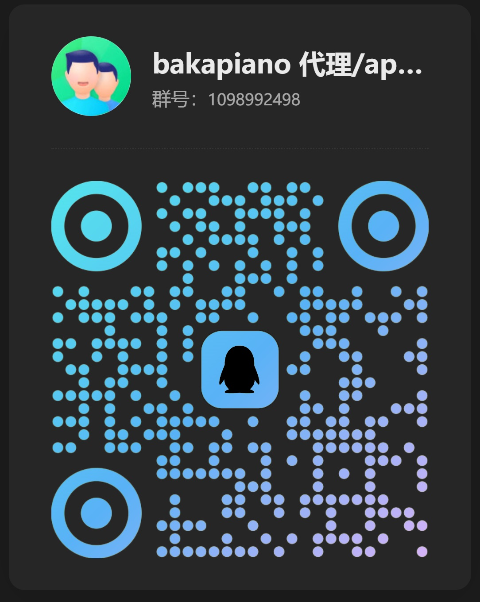
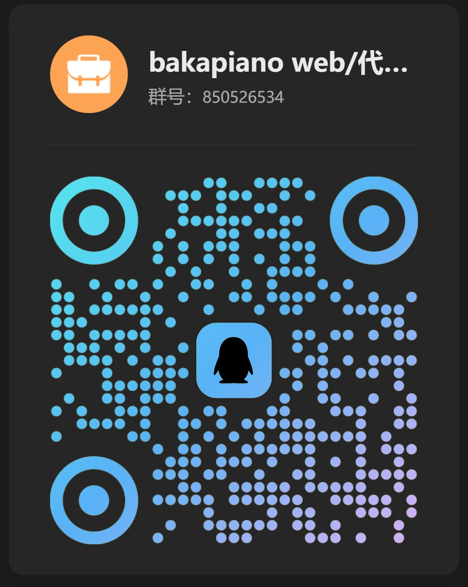

<div align="center">
  
  <h1>maimai Score Hub</h1>
  <p>面向舞萌 DX 玩家的成绩同步、管理与分析平台</p>
  <p>
    <a href="https://maiscorehub.bakapiano.com">访问网站</a>
    ·
    <a href="https://github.com/bakapiano/maimai-score-hub/issues">问题反馈</a>
  </p>
</div>

## 项目简介

maimai Score Hub 可以从 maimai DX NET 同步个人成绩，并提供 Best 50、等级与版本完成度、单曲成绩历史、筛选搜索和图片导出等功能。网站也可将成绩导出至水鱼查分器与落雪查分器。

> [!IMPORTANT]
> sdgb 部分的设计与实现采用闭源方式维护。

## 项目结构

```text
maimai-score-hub/
├─ frontend/      用户网站
├─ admin/         管理后台
├─ backend/       API、任务调度与成绩存储
├─ worker/        DX NET 数据同步 Worker
├─ shared/        共享类型、Schema 与 API 契约
├─ ocr-api/       成绩截图 OCR 服务
├─ automation/    Android 自动化服务
├─ android-app/   Android 客户端
└─ docs/          设计与开发文档
```

## 本地开发

开发环境需要 Node.js 22+、npm、MongoDB 7 和 Redis 7。各包使用独立的 `package-lock.json` 管理依赖。

```bash
git clone https://github.com/bakapiano/maimai-score-hub.git
cd maimai-score-hub

npm --prefix shared ci
npm --prefix backend ci
npm --prefix frontend ci

npm --prefix shared run build
```

参考 [`backend/.env.example`](./backend/.env.example) 配置 MongoDB、Redis、JWT 与本地跨域来源，然后分别启动后端和用户前端：

```bash
npm --prefix backend run start:dev
npm --prefix frontend run dev
```

用户前端默认运行于 <http://127.0.0.1:3001>，后端默认运行于 <http://127.0.0.1:9050>。更多模块说明和设计文档见 [`docs/`](./docs)。

## 交流群

扫码加入对应 QQ 群；点击图片可以查看原图。

|                                                                                 用户交流群                                                                                  |                                                                                      开发交流群                                                                                       |
| :-------------------------------------------------------------------------------------------------------------------------------------------------------------------------: | :-----------------------------------------------------------------------------------------------------------------------------------------------------------------------------------: |
|                                                                              QQ 群：1098992498                                                                              |                                                                                   QQ 群：850526534                                                                                    |
| <a href="./frontend/public/community/user-group-qr.jpg"></a> | <a href="./frontend/public/community/developer-group-qr.jpg"></a> |

## 参与贡献

欢迎通过 [Issues](https://github.com/bakapiano/maimai-score-hub/issues) 提交问题和建议，也欢迎提交 Pull Request。开发相关讨论可加入上方开发交流群。

## 致谢

- [Diving-Fish 查分器](https://www.diving-fish.com/maimaidx/prober/)
- [落雪咖啡屋](https://maimai.lxns.net/)
- B50 图片渲染布局与素材参考 [Yuri-YuzuChaN/maimaiDX](https://github.com/Yuri-YuzuChaN/maimaiDX)

## 免责声明

本项目由玩家社区维护，与游戏官方及相关运营方无隶属关系。maimai、舞萌 DX 及相关素材的权利归其各自权利方所有。
