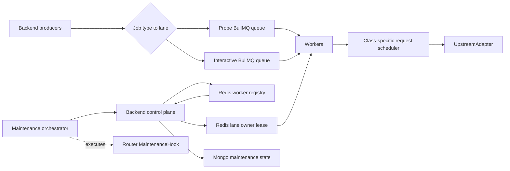

# 架构与 Worker/Lane 决策

[← 返回总览](./README.md)

## 1. 组件



Backend producer 只选择 lane，不选择机器。控制面根据 workerClass、capability、health、drain 和 lane lease 选择唯一 active worker。

## 2. Worker 配置

```ts
type WorkerClass = "recoverable" | "stable";
type WorkerCapability = "probe" | "interactive";

type WorkerConfig = {
  workerId: string;
  workerClass: WorkerClass;
  capabilities: WorkerCapability[];
  autoRecoveryHookKind?: string;
};
```

Worker class 在进程生命周期内不可变：

- Recoverable 必须配置 `autoRecoveryHookKind`，并且控制面存在对应 hook adapter。
- Stable 不配置 autoRecoveryHookKind，必须配置严格 rate policy。
- 两类 worker 都可以同时具备 Probe/Interactive capability，以支持双向 failover。

## 3. Active Lane

Heartbeat 区分“能做”和“正在做”：

```json
{
  "workerId": "worker-stable-a",
  "workerClass": "stable",
  "capabilities": ["probe", "interactive"],
  "activeLanes": ["interactive"],
  "drainingLanes": []
}
```

当 Recoverable Probe owner 故障时，该 Stable worker 获得 Probe lease：

```json
{
  "activeLanes": ["interactive", "probe"]
}
```

Handback 时 Probe 进入 draining，Interactive 继续 active。

## 4. Lane Policy

```ts
type LanePolicy = {
  lane: "probe" | "interactive";
  queueName: string;
  requiredCapability: WorkerCapability;
  preferredWorkerClasses: WorkerClass[];
  leaseTtlMs: number;
  leaseRenewMs: number;
  drainGraceMs: number;
};
```

固定策略：

| Lane          | mode      | Class priority       | Job types      |
| ------------- | --------- | -------------------- | -------------- |
| `probe`       | exclusive | Recoverable → Stable | Rival/Map      |
| `interactive` | exclusive | Stable → Recoverable | Scan/Add/Music |

只有高优先级 class 没有 healthy/eligible 候选时才跨 class。

## 5. Worker 进程

```text
Process
├─ heartbeat / desired-state loop
├─ lane lease client
├─ active job registry
├─ Probe BullMQ Worker          paused/resumed by lease
├─ Interactive BullMQ Worker    paused/resumed by lease
├─ class-specific scheduler
│  ├─ Recoverable: concurrency + breaker, no QPS
│  └─ Stable: strict priority-aware limiter
└─ session cleanup coordinator
```

`pause(true)` 只暂停本地 consumer，不使用 BullMQ global pause。

## 6. Stable Scheduler

Stable 维护三个独立 wait queue：

```text
cleanup
interactive
probe
```

Root token 到达时：

1. cleanup 有 waiter：发给 cleanup。
2. 否则 Interactive 有 waiter：发给 Interactive。
3. 否则发给 Probe。

Probe 无权把 waiter 预先塞进一个全局 FIFO。Interactive 无 waiter 时 Probe 可使用全部空闲 token；Interactive 到达后获得下一个 token。

Probe concurrency cap=4，并为 Interactive 保留 HTTP connection/semaphore slot。Limiter 只控制每次请求启动，不串行占用整个 job 生命周期。

现有 promise-chain FIFO token bucket 不能满足该要求，必须替换为 priority-aware scheduler。

## 7. Recoverable Scheduler

Recoverable：

- 不创建 QPS token bucket；
- 使用已确认的 type concurrency；
- 保留空响应 breaker；
- Breaker open 后关闭请求 gate；
- Auto Recovery 前先完成 lane failover。

Recoverable 临时承接 Interactive 时属于降级状态，Admin/alert 必须显示 `interactive_on_recoverable`。

## 8. 公网 IP 与进程约束

- 一个公网 IP 只运行一个 sdgb-worker 进程。
- Worker 上报 `publicIp` 和 `networkEpoch`。
- IP 变化后 networkEpoch 增加，health 变为 unknown，重新验证后才能获得 lane。
- Failover 目标必须是另一个 worker，且已知 publicIp 时必须不同。
- Worker 发布采用 graceful stop-start；旧进程完全停止后才启动新进程。

## 9. 架构不变量

- Queue 名与机器无关。
- Job 创建时固化 lane 和 routingVersion。
- Lane owner 以 Redis lease token/epoch 为事实源。
- Worker 失去 lease 后立即 pause，不领取新 job。
- 每次请求前与 terminal patch 前检查 fencing epoch。
- Recoverable/Stable class priority 写在 lane policy，不散落在业务 producer。
- Router hook 不操作 queue/lease，也不选择 standby。
