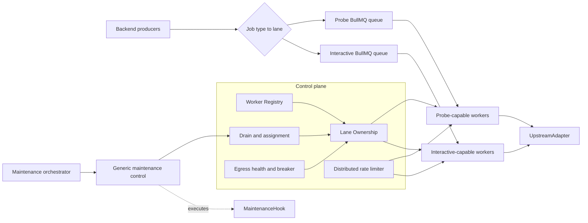

# 总体架构与扩展模型

[← 返回总览](./README.md)

## 1. 架构



Backend 业务模块只选择 lane，不选择机器。Worker 是否消费某条 lane，由 capability、assignment、lease、drain 和 upstream health 共同决定。

维护操作同样与设备实现解耦。控制面只处理 drain、handoff、verification gate 和 handback；外部 orchestrator 在获得 `standby active` 确认后执行 `MaintenanceHook`。Hook 可以是路由器重启、网络切换、主机维护或人工确认，核心状态机不包含任何设备协议。

## 2. Capability 与 Assignment 分离

当前 `role=probe|interactive|all` 同时表达“能做什么”和“正在做什么”，不适合动态 failover。目标模型拆成：

```text
capabilities = worker 能安全处理的 lane/job 类型
activeLanes  = 控制面当前允许 worker 消费的 lane
```

示例：

```json
{
  "workerId": "worker-standby-a",
  "capabilities": ["probe", "interactive"],
  "activeLanes": ["interactive"],
  "drainingLanes": [],
  "egressGroup": "egress-a"
}
```

该 worker 常态只处理 Interactive，但不重启进程即可在获得 Probe lease 后恢复本地 Probe consumer。所有 lane 共用同一进程的连接池、active job registry 和 egress rate limiter。

## 3. Lane 是部署策略，不是机器名

Lane 名称必须稳定且与机器无关：

```text
probe
interactive
session        # 未来可选
probe-shard-N  # 未来可选
```

禁止使用：

```text
server3-jobs
home-worker-jobs
azure-jobs
```

机器替换、出口变化和扩容不应导致 producer 或 job schema 改名。

## 4. Lane Policy

控制面为每条 lane 配置策略：

```ts
type LanePolicy = {
  mode: "exclusive" | "shared";
  requiredCapability: string;
  maxActiveWorkers: number;
  failoverEnabled: boolean;
  egressRatePolicy: string;
};
```

初始配置：

| Lane          | mode        | max active | 说明                                                 |
| ------------- | ----------- | ---------: | ---------------------------------------------------- |
| `probe`       | `exclusive` |          1 | 上游风控与配额未完全明确，优先保证单出口、单 owner。 |
| `interactive` | `shared`    |          1 | 数据结构允许扩展，第一阶段仍保持一台 active。        |

`shared` 不代表无限 active。控制面仍必须检查 egress budget、worker health 和 session capability。

## 5. Job 路由与数据稳定性

创建 job 时，Backend 根据代码版本中的静态映射选择 lane，并把结果持久化：

```ts
type SdgbJobRouting = {
  lane: "probe" | "interactive" | "session";
  routingVersion: number;
};
```

后续 queue repair、retry 和 cancel 使用 job 自己的 `lane`，不能再次按最新映射推导。这样未来把某个 job type 移到新 lane 时，旧 job 仍在原 lane 完成，不会同时出现在两条队列。

迁移前的旧文档若没有 `lane`，由一次性 migration 或显式 legacy routing version 补齐；运行时不长期保留隐式 fallback。

## 6. Worker 进程结构

一个进程可为每个 capability 创建一个本地 BullMQ Worker，但默认保持暂停：

```text
Process
├─ shared global request gate
├─ egress distributed limiter client
├─ active job registry
├─ Probe BullMQ Worker          paused/resumed by ownership
├─ Interactive BullMQ Worker    paused/resumed by assignment
└─ session cleanup coordinator  enabled only with session capability
```

本地 `pause(true)` 只停止该进程领取，不允许使用 BullMQ global pause 作为 lane ownership，因为 global pause 会影响其他机器。

## 7. 添加新机器

新增 worker 只需要：

1. 部署相同版本镜像。
2. 设置唯一 `workerId`。
3. 配置 `capabilities`、`egressGroup` 和各 lane preference。
4. 连接同一 Backend/Redis 控制面。
5. 通过 startup self-check 后开始 heartbeat。
6. 控制面将其纳入候选；除非获得 assignment/lease，否则不消费 exclusive lane。

配置示例只表达内部调度属性：

```env
WORKER_ID=worker-new-a
SDGB_CAPABILITIES=probe,interactive
SDGB_EGRESS_GROUP=egress-new-a
SDGB_PROBE_PREFERENCE=50
SDGB_INTERACTIVE_PREFERENCE=20
```

Preference 数值越小越优先。Preference 只用于候选排序，不能绕过 health、drain、版本和 lease 校验。

## 8. 扩容路径

### 8.1 容灾扩容

首选方式：一台 active，多台 standby。新增机器不增加上游吞吐，只缩短故障恢复时间。

### 8.2 Interactive 多 Active

当用户交互量需要扩容时，可将 `interactive.maxActiveWorkers` 提高。前提：

- egress 分布式限流已启用；
- 有副作用 job 已有幂等或 outcome-unknown 处理；
- 会话 cleanup 可跨 worker fencing；
- Admin 能查看每个 worker 的 active job 和出口健康。

### 8.3 Probe 分片

只有单 owner 在安全限流下无法按目标时延清空队列时，才引入：

```text
probe-shard-0
probe-shard-1
...
```

按稳定业务键做一致性哈希，每个 shard 独立配置 primary/standby lease。扩缩 shard 必须有显式迁移版本，不能在运行中直接改变 hash 环导致同一用户并发探测。

## 9. 架构不允许的捷径

- 在同一 BullMQ queue 中领取后再按 job type 退回。
- 用机器 hostname 作为 queue 名。
- 让 standby 通过轮询 Mongo 自行猜测是否应该接管。
- 多进程共享出口却各自使用本地 QPS bucket。
- 仅依赖 heartbeat 判定 ownership，不使用带 token 的原子 lease。
- Lease 丢失后继续完成非 cleanup 上游操作。
- 自动 failover 到 `upstreamHealth=blocked` 或版本不兼容的 worker。
