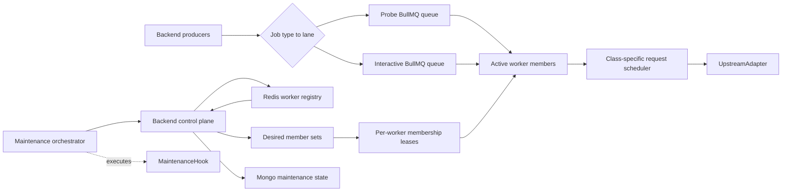

# 架构与 Worker/Lane 决策

[← 返回总览](./README.md)

## 1. 组件



Backend producer 只选择 lane，不选择机器。控制面根据 worker class、capability、health、drain 和 `LanePolicy` 计算每条 lane 的 desired member set。每个成员持有独立 TTL membership；同一 lane 的 active member 共同消费同一个 BullMQ queue。

## 2. Worker 配置

```ts
type WorkerClass = "recoverable" | "stable";
type WorkerCapability = "probe" | "interactive";

type WorkerConfig = {
  workerId: string;
  workerClass: WorkerClass;
  capabilities: WorkerCapability[];
  autoRecoveryHookKind?: string;
};
```

Worker class 在进程生命周期内不可变：

- Recoverable 必须配置 `autoRecoveryHookKind`，并且控制面存在对应 hook adapter。
- Stable 不配置 `autoRecoveryHookKind`，必须配置严格 rate policy。
- 两类 worker 都可以同时具备 Probe/Interactive capability，以支持双向 failover。
- `capabilities` 表示“这个进程能消费哪些 lane”，不表示当前已被选中。

一个公网 IP 只部署一个 worker 进程。

## 3. Lane Membership

Heartbeat 同时报告 capability 和本进程当前 membership：

```json
{
  "workerId": "worker-stable-a",
  "workerClass": "stable",
  "capabilities": ["probe", "interactive"],
  "laneMemberships": [
    {
      "lane": "interactive",
      "state": "active",
      "membershipEpoch": 42
    }
  ]
}
```

如果 Interactive 配置两个 Stable active member，另一个 Stable 也持有自己的 membership epoch，并消费同一个 Interactive queue。任一成员 drain 不会暂停其他本地 consumer。

Stable 作为 Probe fallback 时，可同时具有两个 active membership：

```json
{
  "laneMemberships": [
    {
      "lane": "interactive",
      "state": "active",
      "membershipEpoch": 42
    },
    {
      "lane": "probe",
      "state": "active",
      "membershipEpoch": 57
    }
  ]
}
```

`draining` 表示该进程已经停止领取该 lane 的新 job，只在完成或安全重排已经 claim 的 job。它不计入可领取新 job 的 active count。

## 4. Lane Policy

```ts
type LanePolicy = {
  lane: "probe" | "interactive";
  queueName: string;
  requiredCapability: WorkerCapability;
  preferredClass: WorkerClass;
  preferredActiveCount: number;
  fallbackClass: WorkerClass;
  fallbackActiveCount: number;
  membershipTtlMs: number;
  membershipRenewMs: number;
  drainGraceMs: number;
};
```

固定 class priority：

| Lane          | Preferred     | Fallback      | Job types      |
| ------------- | ------------- | ------------- | -------------- |
| `probe`       | `recoverable` | `stable`      | Rival/Map      |
| `interactive` | `stable`      | `recoverable` | Scan/Add/Music |

两个 count 均必须为正整数。生产初始配置可以均为 `1`，但选择器、membership lease、heartbeat 和测试必须支持任意配置数量的成员。

## 5. Desired Member Set 选择

每次 reconcile 对每条 lane 独立执行：

1. 过滤 healthy、fresh、capability 匹配、未 drain、版本兼容且公网 IP 无冲突的 worker。
2. 从 preferred class 选择最多 `preferredActiveCount` 个成员。
3. 如果至少一个 preferred member 已确认 active，fallback member 全部停止新 claim 并进入 drain。
4. 如果 preferred active count 为 `0`，从 fallback class 选择最多 `fallbackActiveCount` 个成员。
5. 同 class 有空位时优先保留健康的现有 member，再按负载和稳定排序补足，避免无意义抖动。

控制面只有一个经 Redis 选主的 reconciler 写 desired set；Backend 多副本不会各自选出不同集合。

Class 切换使用以下顺序：

```text
select preferred candidates
→ acquire and confirm preferred membership
→ atomically stop fallback new claims
→ fallback finishes/requeues claimed jobs
→ release fallback membership
```

切换过程中 fallback 可以短暂保留 `draining` membership 作为既有 job 的 fence，但不能再 claim 新 job。因此“preferred 存活时 fallback inactive”约束针对新 job 消费始终成立。

## 6. BullMQ 分流语义

- 每条 lane 只有一个 queue，queue 名与 worker 或 class 无关。
- 所有 active member 启动该 lane 的本地 BullMQ consumer。
- BullMQ 根据 consumer 可用性分配不同 job，不做机器级定向或 consistent hash。
- 单个 job 只被一个 consumer claim；BullMQ lock 与 Mongo execution fence 共同防止重复终态写入。
- 实际流量占比受每个 worker 的 consumer concurrency、job 时长和本地 scheduler 影响，不承诺严格均分。
- 调整 active count 不需要迁移 queue 或修改 producer。

## 7. Worker 进程

```text
Process
├─ heartbeat / desired-state loop
├─ per-lane membership client
├─ active job registry
├─ Probe BullMQ Worker          paused/resumed by local membership
├─ Interactive BullMQ Worker    paused/resumed by local membership
├─ class-specific scheduler
│  ├─ Recoverable: concurrency + breaker, no QPS
│  └─ Stable: strict priority-aware limiter
└─ session cleanup coordinator
```

`pause(true)` 只暂停当前进程的 consumer，不使用 BullMQ global pause。失去一个 lane membership 也不影响该进程的其他 lane。

## 8. Stable Scheduler

每个 Stable worker 独立维护三个 wait queue：

```text
cleanup
interactive
probe
```

该 worker 的 root token 到达时：

1. Cleanup 有 waiter：发给 cleanup。
2. 否则 Interactive 有 waiter：发给 Interactive。
3. 否则发给 Probe。

Probe 无权把 waiter 预先塞进一个全局 FIFO。Interactive 无 waiter 时 Probe 可使用空闲 token；Interactive 到达后获得该 worker 的下一个 token。

Probe concurrency cap=4，并为 Interactive 保留 HTTP connection/semaphore slot。Limiter 只控制每次请求启动，不串行占用整个 job 生命周期。现有 promise-chain FIFO token bucket 不能满足该要求，必须替换为 priority-aware scheduler。

多个 Stable member 各自执行完整的 `global=1.5 QPS` 与 job-type ceiling；本实现没有跨 IP 的 distributed limiter。

## 9. Recoverable Scheduler

每个 Recoverable：

- 不创建 QPS token bucket；
- 使用已确认的 total/type concurrency；
- 保留空响应 breaker；
- Breaker open 后关闭本进程 request gate；
- Auto Recovery 前只移除本进程的 membership，并确认受影响 lane 仍有非目标 coverage。

Recoverable 临时承接 Interactive 时属于降级状态，Admin/alert 必须显示 `interactive_on_recoverable`。

## 10. 公网 IP 与进程约束

- 一个公网 IP 只运行一个 sdgb-worker 进程。
- Worker 上报 `publicIp` 和 `networkEpoch`。
- IP 变化后 `networkEpoch` 增加，health 变为 unknown，旧 membership renew 失败，重新验证后才能加入 desired set。
- 两个 live worker 报告相同公网 IP 时均标记部署冲突，不同时激活。
- Worker 发布采用 graceful stop-start；旧进程完全停止后才启动新进程。

## 11. 架构不变量

- Queue 名与机器无关；job 创建时固化 lane 和 routingVersion。
- Desired member set 决定谁可申请 membership；每个 worker/lane 使用独立 token 和 epoch。
- Worker 失去 membership 后立即 pause 对应本地 consumer，不影响其他 member。
- 每次请求前与 terminal patch 前检查 membership/execution fencing。
- 同 class 其他 active member 存活时，单 member 故障不会触发跨 class failover。
- Preferred active count 大于 `0` 时，fallback 不领取该 lane 的新 job。
- Recoverable/Stable class priority 只写在 lane policy，不散落在业务 producer。
- MaintenanceHook 不操作 queue/membership，也不选择其他 worker。
