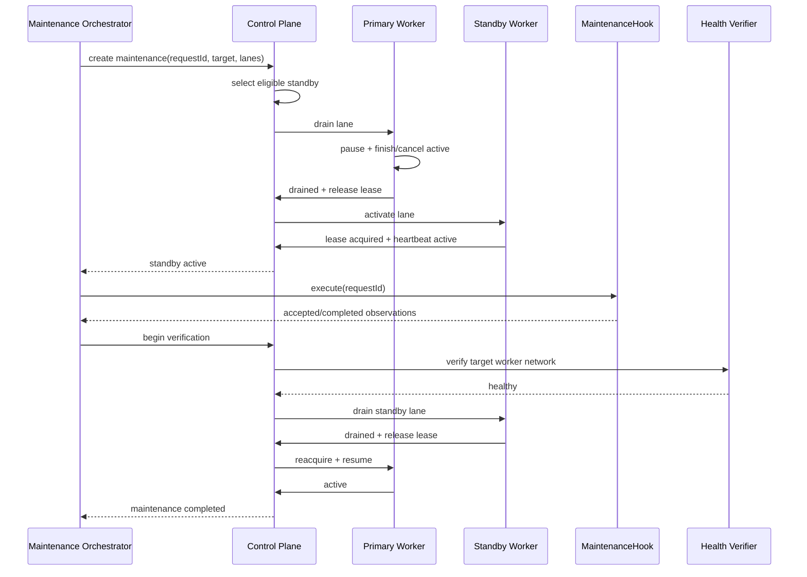

# 计划内与非计划 Failover 状态机

[← 返回总览](./README.md)

## 1. 核心原则

Failover 核心只管理 lane 和 worker，不管理具体设备：

```text
drain primary
→ activate standby
→ execute external maintenance hook
→ verify recovered worker network
→ hand back
```

“重启路由器”只是 `MaintenanceHook` 的一种实现。Backend/worker 不包含设备登录、重启命令、网络接口或供应商协议。未来主机重启、VPN 切换、网络拨号、系统升级和人工维护复用同一状态机。

## 2. 参与者

| 参与者                   | 职责                                                                                |
| ------------------------ | ----------------------------------------------------------------------------------- |
| Control Plane            | 记录 maintenance request、选择 standby、下发 drain/assignment、判断阶段是否可推进。 |
| Primary Worker           | 停止领取、处理 active job、释放 owner lease。                                       |
| Standby Worker           | 获取 owner lease、恢复 lane consumer、上报 active。                                 |
| Maintenance Orchestrator | 调用通用控制面，等待 handoff，再执行 hook。                                         |
| MaintenanceHook          | 执行具体维护动作并报告基础恢复结果；不知道 lane 或 worker 选择逻辑。                |
| Health Verifier          | 在维护后验证 worker 公网 IP、连通性和抽象 upstream health。                         |

## 3. MaintenanceHook 契约

```ts
interface MaintenanceHook {
  kind: string;
  execute(context: { requestId: string; abortSignal: AbortSignal }): Promise<{
    accepted: boolean;
    completedAt?: string;
    observations?: Record<string, string | number | boolean | null>;
  }>;
}
```

Hook 只在控制面确认 standby 已 active 后执行。Hook 不得：

- 直接暂停/恢复 BullMQ；
- 直接修改 lane owner key；
- 写死备用 worker；
- 根据自身判断执行 handback；
- 获得 job payload 或上游凭据。

路由器重启 adapter 可记录重启前后公网地址和基础网络恢复，但是否重新启用 primary 由独立 Health Verifier 决定。

### 3.1 `auto_reboot_router` Adapter

现有 `auto_reboot_router` 保持独立服务，只补一层通用 hook adapter：

1. 为 Cron/手工操作生成唯一 maintenance requestId。
2. 调用控制面创建 maintenance，等待 `hookMayRun=true`。
3. 执行现有路由重启动作；设备实现仍完全留在该项目。
4. 网络恢复后提交非敏感 observation，例如连接是否恢复、公网地址是否变化。
5. 等待控制面完成独立 upstream verification 和 handback。

Adapter 不直接访问 BullMQ/owner lease，也不硬编码备用 worker。Cron 与手工入口必须共用进程级互斥和同一 request state；只有整个 maintenance 完成后才记录 success。如果 hook 已触发但进程或网络中断，恢复后根据 requestId 进入 verification，不能直接再次执行重启。

## 4. Maintenance Request

```ts
type MaintenanceRequest = {
  requestId: string;
  targetWorkerId: string;
  affectedLanes: SdgbLane[];
  hookKind: string;
  reason: "scheduled" | "manual" | "network_recovery" | "deploy";
  requestedAt: string;
  deadlineAt: string;
  state: MaintenanceState;
  selectedStandbyByLane: Partial<Record<SdgbLane, string>>;
  errorCode?: string;
  errorMessage?: string;
};
```

`requestId` 由 orchestrator 生成并用于所有重试。重复创建同 requestId 必须返回原状态。

## 5. 状态机

```text
requested
  -> selecting_standby
  -> draining_primary
  -> standby_activating
  -> standby_active
  -> hook_running
  -> recovery_verifying
  -> primary_reactivating
  -> draining_standby
  -> completed

Any pre-hook state -> aborted
Any post-hook failure -> degraded_standby_active
```

### 5.1 requested / selecting_standby

- 验证目标 worker 当前是 affected lane owner。
- 为每条 lane 选择健康且 capability 匹配的 standby。
- Standby 必须是另一个 worker；网络维护时还必须确认两者公网 IP 不同。
- 无 standby 时拒绝进入维护，保持 primary 不变。

### 5.2 draining_primary

Control Plane 设置 primary lane drain：

1. Primary 本地 pause 对应 BullMQ Worker。
2. 不再领取新 job。
3. 等待 active read-only job 在 drain grace 内完成。
4. 到期后对可安全中止 job 发出 cancel/requeue。
5. 会话型或 outcome-unknown job 按专用规则完成 cleanup/reconciliation。
6. `activeJobs=0` 或达到明确安全状态后释放 owner lease。

在 primary 未安全释放前，standby 不得 acquire。

### 5.3 standby_activating / standby_active

- Control Plane 设置 desired owner。
- Standby 获取新 epoch lease。
- Standby resume 本地 lane consumer。
- 至少一个 heartbeat 明确包含该 lane、lease epoch 和 `active=true`。
- Control Plane 再次读取 Redis owner，确认与 heartbeat 一致。

只有完成以上确认才能执行 hook。

### 5.4 hook_running

Orchestrator 调用 MaintenanceHook。Hook timeout 与整个 maintenance deadline 独立。

Hook 调用失败：

- 维护动作尚未开始：进入 aborted，尝试恢复原 primary。
- 维护动作可能已开始：进入 recovery_verifying，不假设原 primary 可用。

### 5.5 recovery_verifying

验证至少包含：

- worker heartbeat 恢复且版本正确；
- publicIp/networkEpoch 可观测；
- 当前出口不处于 breaker open；
- 抽象 `UpstreamHealthCheck` 返回有效成功；
- 连续成功次数达到配置值，避免一次偶然成功；
- 新 primary 没有 active drain/cancel 冲突。

验证失败时保持 standby owner，状态为 `degraded_standby_active`，报警并等待人工或下一次显式 verify。禁止自动循环执行 hook。

### 5.6 handback

1. 原 primary 标记 eligible。
2. Standby pause 新领取。
3. 等待 standby active job 完成或安全重排。
4. Standby 释放 lease。
5. 原 primary acquire 新 epoch 并 resume。
6. Heartbeat/Redis 双确认。
7. 清除 drain/desired owner，maintenance completed。

Handback 失败时保持当前 standby owner，不做双边 resume。

## 6. 计划内时序



## 7. 非计划 Worker 故障

触发条件：

- Registry heartbeat stale；
- owner lease 过期或 renew 失败；
- 进程退出；
- worker 主动报告 fatal control-plane error。

处理：

1. 当前 lease 到期，不由 Backend 强删。
2. 标记原 owner unavailable。
3. 选择另一台公网 IP 不同的健康 standby。
4. Standby acquire 新 epoch。
5. Queue 中 waiting/delayed job 自然继续。
6. 原 active job 由 BullMQ stalled recovery、job fence 和 Mongo execution state共同处理。
7. 旧 worker 恢复后只能注册为 standby，禁止沿用旧内存 assignment。

目标恢复时间：

```text
heartbeat stale + lease expiry + activation <= 45s
```

## 8. 出口被阻断

Circuit breaker open 是 worker 当前网络出口故障，不一定是进程故障：

1. 将该 worker 当前 networkEpoch 标记 blocked。
2. 该 worker 的所有普通上游调用 fail closed。
3. 受影响 exclusive lane owner 进入 drain/release。
4. 候选选择另一个已验证公网 IP 的 worker。
5. Standby 接管。
6. 原出口只有经过 half-open health verification 后才能重新 eligible。

如果 worker 同时承担不依赖该上游的其他职责，不要求整个进程退出。

## 9. Orchestrator 崩溃恢复

Maintenance 状态必须同时有：

- Redis 短期运行态；
- 可审计持久记录。

Orchestrator 重启后按 requestId 读取状态：

| 当前状态                   | 恢复动作                                        |
| -------------------------- | ----------------------------------------------- |
| pre-hook 且 primary 仍健康 | abort 或继续 handoff。                          |
| standby_active             | 可安全重新调用幂等 hook，或等待人工确认。       |
| hook_running               | 先查询 hook observation，不直接重复执行。       |
| recovery_verifying         | 重跑验证，不重复 hook。                         |
| degraded_standby_active    | 保持 standby，等待显式 handback。               |
| handback 中断              | 以 Redis owner 为事实源继续，不根据旧状态猜测。 |

路由维护程序的本地 SQLite 可以保存 hook 历史，但 lane 状态和 ownership 事实源仍是控制面。

## 10. 默认超时

| 阶段                          |                  建议默认 |
| ----------------------------- | ------------------------: |
| standby selection             |                       10s |
| primary drain grace           |                       30s |
| standby activation            |                       30s |
| hook execution                | hook-specific，必须有上限 |
| network recovery verification |                      5min |
| standby drain                 |                       30s |
| handback activation           |                       30s |
| whole maintenance             |                     10min |

超时后必须进入确定的 aborted 或 degraded 状态，不能留在无 owner 或双 owner 状态。
