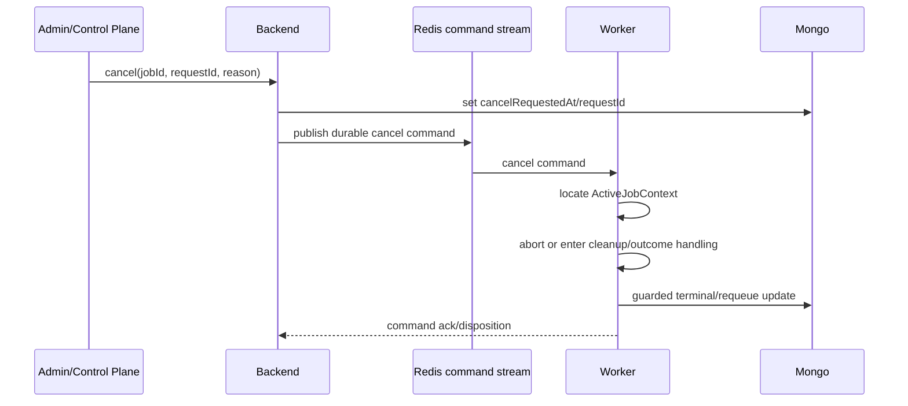

# 主动取消与各 Job 语义

[← 返回总览](./README.md)

## 1. 取消不是删除 BullMQ Job

BullMQ remove/pause 只解决 waiting/delayed 或停止领取，不能可靠终止已经进入 processor 的业务逻辑。Active job 必须协作式取消，并根据是否只读、是否已发出有副作用请求、是否存在会话状态决定终态。

## 2. Job 取消字段

```ts
type CancellationMetadata = {
  cancelRequestedAt: Date | null;
  cancelRequestedBy: string | null;
  cancelReason: string | null;
  cancelRequestId: string | null;
  canceledAt: Date | null;
  cancelDisposition:
    | "not_requested"
    | "removed_before_start"
    | "aborted_read_only"
    | "cleanup_required"
    | "outcome_unknown"
    | "too_late";
};
```

取消命令以 `cancelRequestId` 幂等。重复请求返回现有状态，不重复 abort 或 cleanup。

## 3. Active Job Registry

Worker 维护：

```ts
type ActiveJobContext = {
  jobId: string;
  jobType: SdgbJobType;
  lane: SdgbLane;
  phase: string;
  controller: AbortController;
  leaseEpoch?: number;
  requestStarted: boolean;
  sideEffectPossible: boolean;
  cleanupPromise?: Promise<void>;
};
```

Registry 用于 drain、lease lost、breaker open、进程 shutdown 和管理员 cancel。它不持久化敏感 session 数据；会话恢复仍使用专用 durable lease。

## 4. AbortSignal 传播

Signal 必须从 processor 一直传到底层 adapter：

```text
BullMQ processor
→ processJob
→ runJob
→ job-specific operation
→ UpstreamAdapter request
```

以下等待同样可取消：

- type semaphore；
- process-wide global rate limiter；
- retry backoff；
- health/fence wait；
- HTTP request；
- 分页循环；
- session phase 之间的非 cleanup 等待。

Abort 后不得把普通网络错误误报为 retryable upstream failure。

## 5. 各 Job 语义

| Job type          | waiting/delayed                   | active 且请求未发出            | 请求已发出                                                                       |
| ----------------- | --------------------------------- | ------------------------------ | -------------------------------------------------------------------------------- |
| `get_rival_hash`  | remove 或保留 queued。            | abort，安全 canceled/requeue。 | read-only，可 abort；根据原因 canceled 或 retry。                                |
| `get_user_map`    | remove 或保留 queued。            | abort，安全 canceled/requeue。 | read-only，可 abort；根据原因 canceled 或 retry。                                |
| `scan_qr`         | remove；用户主动取消则 canceled。 | abort。                        | read-only阶段可 abort；若输入已过期则失败而非长期重投。                          |
| `add_rival`       | remove。                          | abort。                        | 可能有副作用，进入 outcome unknown；不能报告已安全取消。                         |
| `get_music_score` | remove，并清除敏感 payload。      | session 建立前可 abort。       | session 建立后先执行 cleanup；cleanup 终态决定 canceled、failed 或 unconfirmed。 |

## 6. Read-only Probe 取消

`get_rival_hash` 和 `get_user_map` 是 failover 的主要可迁移 job：

```text
cancel due to planned drain
→ abort active request if grace expired
→ Mongo status=queued, retryReason=lane_handoff
→ BullMQ delayed/waiting on same Probe queue
→ new owner consumes same jobId
```

如果请求恰好已成功并开始 terminal patch，使用 execution token 的 compare-and-set 决定唯一结果；取消请求不能覆盖已完成结果。

## 7. 有副作用 Job

对可能产生副作用的操作，取消点分为：

```text
before_request       -> canceled
request_in_flight    -> outcome_unknown
confirmed_success    -> completed, cancel too_late
confirmed_failure    -> failed/canceled by policy
```

`outcome_unknown` 必须：

- 禁止通用自动重投；
- 记录 reconciliation required；
- 对外给出稳定、非误导性状态；
- 由 job-specific query/idempotency 规则确认后再决定是否创建新 attempt。

## 8. 会话型 Job

会话型 job 的取消优先级：

```text
fence safety
> remote/session cleanup
> durable cleanup state
> canceled terminal state
> new business work
```

要求：

- 建立 session 后，通用 AbortSignal 只能停止新的业务读取，不能跳过 cleanup。
- `cancel()` 返回的是“已接受取消”，不是“已安全终止”。
- 只有 cleanup confirmed 后才能写 `status=canceled`。
- Cleanup unconfirmed 时保留 durable lease、阻止冲突新 job，并显示 retryAfter/运维状态。
- Lease lost 的旧 worker 不再持久化业务结果，但允许按 fencing 规则做 best-effort cleanup。

本文不描述 session 协议或凭据格式。

## 9. Drain

Drain 是 lane/worker 级取消协调：

1. 标记 worker/lane draining。
2. 本地 pause，停止领取。
3. 等待 `drainGraceMs`。
4. Read-only active job 可继续完成。
5. 超时后 abort 并 requeue read-only job。
6. 有副作用 job 等待明确结果或进入 outcome unknown。
7. 会话 job 等待 cleanup 安全点。
8. Active registry 达到安全空闲后上报 drained。

Planned maintenance 只有收到 drained ack 才进入 standby activation/hook。

## 10. Worker Shutdown

SIGTERM、进程升级和控制面 drain 共用同一个 shutdown coordinator，不能维护三套不同语义。

```text
pause all local consumers
→ mark draining
→ wait/cancel read-only jobs
→ finish side-effect disposition
→ run session cleanup
→ close BullMQ/Redis/HTTP/log shipper
→ exit
```

强制退出 timeout 到达前若仍有不安全 session，依赖 durable lease 恢复；日志和状态必须明确指出未完成 cleanup。

## 11. 控制面取消流程



如果 worker 已离线，Backend 根据 BullMQ/Mongo 状态处理 waiting job；active job 等 stalled recovery 后由新 worker读取 cancel request，再决定 disposition。

## 12. 竞态规则

- Complete 与 cancel 同时发生：第一个满足 execution token 条件的 terminal compare-and-set 胜出。
- Retry 与 cancel 同时发生：cancelRequestedAt 阻止新 attempt 开始。
- Lease lost 与 cancel 同时发生：lease safety 先执行，最终 disposition 保留 cancel reason。
- Breaker open 与 user cancel 同时发生：不重复 requeue；用户 cancel 优先决定 job 不再重试。
- Queue repair 不修复 `canceled` job，也不绕过 `cancelRequestedAt`。

## 13. 验收

- Waiting job 取消后不会被 repair 重新加入。
- Active Probe job 在 drain timeout 后可中止并由新 owner 使用同 jobId 完成。
- 已发出有副作用请求的 job 不会被标为普通 canceled 并自动重投。
- 会话型 job 取消不会跳过 cleanup。
- 进程 SIGTERM 与管理员 cancel 使用一致状态转换。
- 所有取消命令幂等且可审计。
